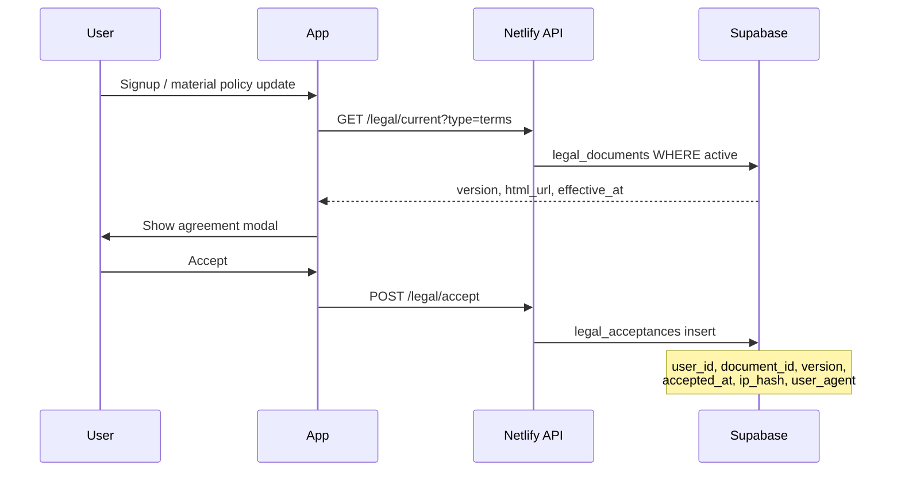

# Florisyn Legal and Compliance Architecture

**Last updated:** 2026-07-30  
**Status:** Architecture and product hooks — **not legal advice**  
**⚠️ Every drafted clause requires review by a licensed attorney before production use.**

---

## Purpose

Define how Florisyn stores, presents, and enforces legal agreements between:

- Florisyn (platform) ↔ Florist (subscriber)
- Florisyn ↔ End customer (via florist storefront)
- Florisyn ↔ Marketplace seller / wholesaler
- Florisyn ↔ Staff (where applicable)

---

## Document types

| Document | Audience | Current state | Target storage |
|----------|----------|---------------|----------------|
| Terms of Service | Florists + public | Static HTML `public/legal/terms/` | Versioned DB + static mirror |
| Privacy Policy | All users | `public/legal/privacy/` | Versioned DB |
| Cookie Policy | Web visitors | `public/legal/cookies/` | Versioned DB |
| Acceptable Use Policy | Florists | ⚪ Not drafted | `legal_documents` table |
| Florist Agreement (SaaS) | Subscribers | ⚪ Not drafted | Acceptance on signup |
| Wholesaler Agreement | B2B sellers | ⚪ Not drafted | Marketplace onboarding |
| Marketplace Agreement | Buyers/sellers | ⚪ Not drafted | Checkout gate |
| Subscription Terms | Billing | Partial in Terms | Link from Subscription Center |
| Delivery Policy | End customers | ⚪ Per-shop template | Instant website page type |
| Refund/Cancellation Policy | End customers | ⚪ Per-shop template | Storefront settings |
| AI Usage Policy | Florists | ⚪ Not drafted | Settings + Lily/Rose UI |
| Copyright / DMCA | Platform | ⚪ Not drafted | Admin procedure doc |
| Accessibility Statement | Public | `public/legal/accessibility/` | Versioned DB |
| Data Processing Addendum (DPA) | EU/enterprise florists | ⚪ Not drafted | Owner admin download |

---

## Product architecture — acceptance flow



---

## Proposed schema (not yet migrated)

```sql
-- REQUIRES ATTORNEY REVIEW BEFORE PRODUCTION
create table legal_documents (
  id uuid primary key default gen_random_uuid(),
  doc_type text not null,
  version text not null,
  title text not null,
  body_html text,
  body_url text,
  effective_at timestamptz not null,
  requires_reacceptance boolean default false,
  created_at timestamptz default now(),
  unique (doc_type, version)
);

create table legal_acceptances (
  id uuid primary key default gen_random_uuid(),
  user_id uuid references auth.users(id),
  shop_id uuid references shops(id),
  document_id uuid references legal_documents(id),
  document_version text not null,
  accepted_at timestamptz not null default now(),
  ip_hash text,
  user_agent text,
  metadata jsonb default '{}'
);
```

**RLS:** Users read active documents; acceptances insert own row; shop owners read shop acceptances.

---

## Required behaviors

| Requirement | Implementation |
|-------------|----------------|
| Legal document versioning | `legal_documents.version` semver or date stamp |
| Required acceptance | Block app access until current ToS + Privacy accepted |
| Acceptance timestamp | `legal_acceptances.accepted_at` |
| User/account/version metadata | FK to user + shop + document version |
| IP metadata (where lawful) | Store hashed IP only — consult counsel on jurisdiction |
| Reacceptance after material changes | `requires_reacceptance` flag → modal on next login |
| Downloadable copies | PDF/HTML export from acceptance record + document snapshot |
| Legal hold | `legal_holds` table flags accounts — suspend deletion jobs |
| Audit trail | Append-only acceptances; admin actions in `audit_events` |

---

## Per-shop policies (storefront)

Florists configure:

- Delivery policy text
- Refund/cancellation policy
- Substitution policy (industry standard)

Stored in `shops.settings.legal_pages` jsonb — rendered on instant website with shop branding.

**Attorney review:** Florist-customizable text is florist responsibility; platform provides templates labeled "sample only."

---

## AI usage policy (architecture)

- Disclose AI assists design suggestions, not professional advice.
- Prohibit entering PCI/SSN into Lily/Rose chat (UI warning + server truncation in logs).
- Feature flag `VOICE_WAKE` off until policy section accepted.

---

## Email and sender identity

- Do not misrepresent Supabase default sender as custom florist domain until SPF/DKIM verified.
- Architecture: `shops.transactional_email_from` + verification status field.
- **Blocked until:** Owner configures custom SMTP or Resend/Postmark with verified domain.

---

## GDPR / CCPA hooks

| Right | Mechanism |
|-------|-----------|
| Access | Export customer data via shop admin |
| Deletion | Soft-delete customers (`deleted_at`); hard delete via owner request job |
| Portability | JSON export endpoint (⚪ planned) |
| Consent | Cookie banner + preferences (⚪ planned) |

---

## Accessibility

- Static Accessibility Statement exists at `/legal/accessibility/`.
- Product goal: WCAG 2.1 AA on storefront templates — track in QA, not legal doc.

---

## Implementation phases

1. **Phase 0 (current):** Static marketing legal pages — PRESERVE  
2. **Phase 1:** Schema + acceptance on signup — PLANNED  
3. **Phase 2:** Reacceptance workflow + downloadable PDF — PLANNED  
4. **Phase 3:** Marketplace/wholesaler specific agreements — FUTURE  

---

## Owner actions required

- [ ] Engage licensed attorney for ToS, Privacy, Florist Agreement, DPA
- [ ] Replace placeholder static HTML with counsel-approved text
- [ ] Configure transactional email domain before branded auth emails
- [ ] Define data retention periods per jurisdiction

---

*This document describes product architecture only. It is not legal advice and does not create enforceable terms.*
