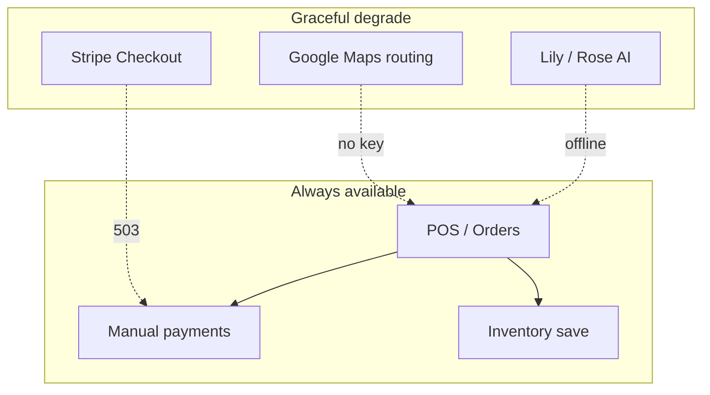

# Florisyn Reliability and Recovery

**Last updated:** 2026-07-30  
**Scope:** Production SPA, Netlify functions, Supabase, Foundation v1 additions

---

## Design principles

1. **Florists must operate on the busiest day** — POS, orders, and payments continue when AI or maps are unavailable.
2. **Fail visibly, not silently** — configuration gaps show admin-facing messages, not blank pages.
3. **Retry only idempotent reads** — payment writes and inventory adjustments are not auto-retried client-side.
4. **Rollback is always possible** — migrations are additive; Netlify keeps deploy history.

---

## Error handling

| Layer | Implementation | Files |
|-------|----------------|-------|
| React global boundary | Catches render errors; link back to Today | `frontend/src/components/ErrorBoundary.tsx`, `App.tsx` |
| Production page errors | `loadPage()` try/catch + `BloomLaunchPolish.errorState` | `public/app.js` |
| API errors | `toast()` + `safePublicError()` on server | `_shared/http.js` |
| Payment failures | Stripe cancel/success paths restore Payment Center | `finishStripeReturn()` in `app.js` |
| AI failures | `refreshAiStatus()` → config required; local bridge optional | `ai-status.js`, `app.js` |
| Maps failures | Route distance returns error message; order still savable | `route-distance.js` |

---

## Loading and empty states

- **Dashboard / lists:** Skeleton and empty cards via existing polish modules.
- **Payment Center:** Shows balance block before methods; 503 when Stripe unconfigured with explicit copy.
- **React preview:** Sample data always present — empty states not yet wired to API.

---

## Health checks

| Endpoint | Purpose |
|----------|---------|
| `/.netlify/functions/health` | Basic liveness |
| `/.netlify/functions/production-health` | AI status, feature flags, env sanity (no secrets) |

**Verification:**
```bash
curl -s "https://<your-site>/.netlify/functions/production-health" | jq .
```

Expected fields: `ok`, `ai.state`, `feature_flags`.

---

## Structured logging

- Netlify functions use `structuredLog()` / `console.warn(JSON.stringify({...}))` for parseable logs.
- AI status history skips log full prompts — truncates errors to 200 chars in `recordOrderStatusChange` catch.
- Client errors can POST to `client-errors.js` (rate limited).

---

## Failure isolation



---

## Backup and restore

Documented in `docs/production/BACKUP-RECOVERY.md`.

| Asset | Method |
|-------|--------|
| Supabase Postgres | Point-in-time recovery (Pro plan) or manual SQL dump before migrations |
| Netlify site | Redeploy previous successful deploy from dashboard |
| Uploaded assets | Supabase Storage bucket backup / replication |
| Env secrets | Netlify env export (secure storage — not in git) |

---

## Migration rollback

Foundation v1 migration (`20260730_foundation_daily_loop_v1.sql`) is **additive only**:

- New tables: `order_status_history`, `audit_events` (if not present)
- New columns: `IF NOT EXISTS` on customers, inventory, deliveries
- Status constraint expanded (includes legacy values)

**Rollback strategy:**

1. **Preferred:** Restore Supabase from backup taken immediately before apply.
2. **Partial:** Do not drop tables in production; disable features reading new columns via feature flags.
3. **Netlify:** Redeploy commit `3fd33de` (pre-foundation) if code rollback needed — backup branch `backup/florisyn-pre-foundation-20260730-1415`.

See `docs/production/MIGRATION-ORDER.md` for full ordering.

---

## Deployment rollback

```bash
# 1. In Netlify UI: Deploys → select last green deploy → Publish deploy
# 2. Or redeploy backup branch after review:
git checkout backup/florisyn-pre-foundation-20260730-1415
# trigger Netlify build from that commit (owner-controlled)
```

**Do not deploy automatically** — owner performs one controlled release after QA.

---

## Error monitoring integration point

No third-party APM is bundled (cost control). Integration hook:

- `client-errors.js` — browser error POST endpoint
- `structuredLog()` — forward Netlify logs to Datadog/Sentry via Netlify log drains (owner configures)

Recommended owner setup:

1. Enable Netlify log drain → Sentry/Datadog
2. Alert on function error rate > 5% over 15 minutes
3. Alert on `production-health` `ok: false`

---

## Network interruption

- Client `api()` shows toast on fetch failure; does not corrupt local cart state.
- Split payment session persisted in `sessionStorage` for Stripe return continuity.
- Offline POS: not supported — show network error; do not queue writes (prevents duplicate orders).

---

## Database failure

- Supabase outage: all authenticated routes return 5xx; login page should still load (static).
- Missing migration: `recordOrderStatusChange` catches insert failure and logs warning — order save still succeeds.

---

## Testable safeguards (Foundation v1)

| Scenario | Expected behavior | Test |
|----------|-------------------|------|
| AI env missing | `configuration_required` | `tests/foundation-v1.test.js` |
| Order status NEW | Maps to PENDING | Same |
| Stripe unset | Payment hub 503 with message | Manual / payment-hub tests |
| React crash | Error boundary UI | Throw in dev component |
| Status history table missing | Order PATCH still works | Pre-migration staging |

---

## Known gaps

- No automatic client token refresh
- No global offline queue for orders
- No synthetic uptime monitoring configured (owner action)
- React app not in production deploy path — failures there do not affect florists on `public/`

---

*Honest reliability: we reduce blast radius and enable recovery; we do not claim zero downtime.*
