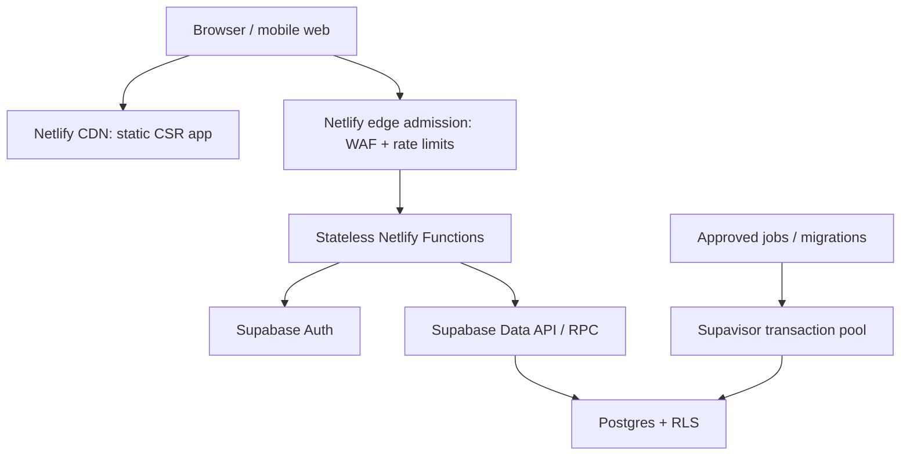
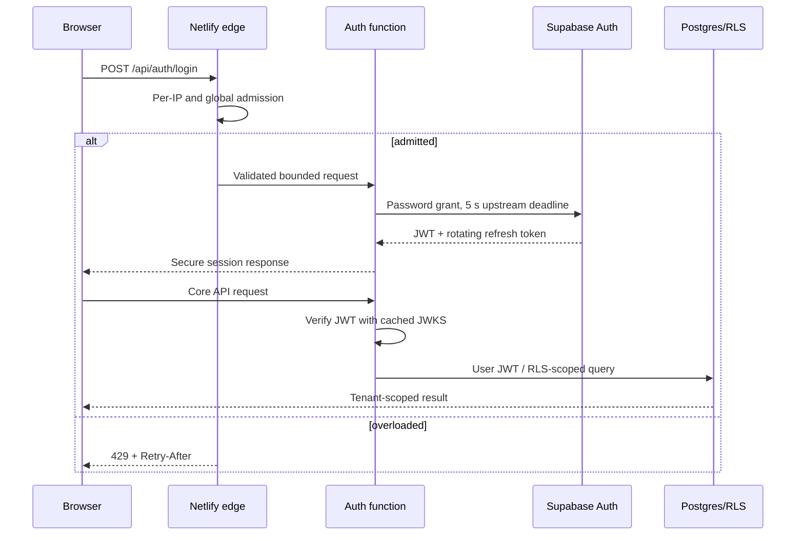
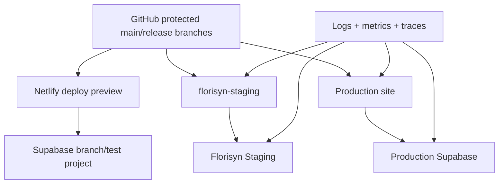

# FLORISYN Scalability, Performance, and Stability Blueprint

**Status:** Architecture baseline and implementation plan
**Date:** August 4, 2026
**Scope:** Extend the existing Netlify + Supabase + GitHub stack from 1,000 active/concurrent login attempts toward 10,000+ concurrent authenticated sessions. No stack replacement is proposed.
**Release truth:** Functional staging has passed the P0-14/P0-15 boundary, but FLORISYN is **not capacity-certified** until the staged load gates in section F pass.
**Product authority:** This document is a supporting nonfunctional architecture under `FLORISYN-BLUEPRINT-GOVERNANCE-MAP.md`. It may strengthen capacity, security, and reliability, but it may not reorder the Master Architecture Bible, redesign the approved Today experience, or activate a future-phase module.

## A. Executive Summary

FLORISYN can scale on its current stack if login bursts are admitted at the Netlify edge, request functions remain stateless, Supabase Auth remains the token issuer, browser requests continue to use RLS-scoped JWTs, and database concurrency is bounded independently of user concurrency.

The key architectural fact is that 10,000 signed-in users must not become 10,000 Postgres connections. The existing Netlify functions use `supabase-js` over Supabase Auth/PostgREST HTTP, so they do not need a direct Postgres connection per function instance. Direct database clients, if added later for jobs, must use Supavisor transaction pooling and small pools.

Current evidence from Florisyn Staging:

| Item | Current evidence | Capacity implication |
|---|---:|---|
| Public tables with RLS | 92/92 | Strong fail-closed base |
| PostgreSQL | 17.6 | Current supported platform |
| `max_connections` | 60 | Do not model one DB connection per user |
| Current connections at audit | 13 total / 1 active | Baseline only; not a load result |
| Public policies | 109 total | Includes closed-beta, community, library, and fail-closed domains |
| Policies calling `auth.uid()` | 26 | Optimize to init-plan form after regression tests |
| Netlify auth limiter | Per-isolate in-memory `Map` | Not authoritative under horizontal scaling |
| React initial JS | About 98 KB gzip | Within the proposed initial-route budget |
| Largest hero image | About 963 KB | Must be resized/modernized before broad launch |

Priority order:

1. Add distributed Netlify path rate limits and replace the per-isolate limiter as the primary login control.
2. Add end-to-end deadlines, refresh jitter, idempotency, and overload responses.
3. Optimize the 26 RLS expressions and the measured closed-beta indexes.
4. Add request correlation, dashboards, and alerts before high-volume tests.
5. Pass 50 → 100 → 250 → 500 → 1,000 staged gates before the 3,000/10-second burst.
6. Pass the distributed 10,000-session soak before claiming 10,000-user capacity.

“Zero crash” is treated as an engineering objective: faults must be contained, writes must never be falsely confirmed, and core workflows must fail safely. No platform can honestly promise literal zero failures.

## B. Scalability Architecture (Netlify + Supabase)

### B1. Target topology



Netlify supplies horizontal function instances. FLORISYN supplies bounded work per request, provider-level rate limiting, timeouts, and load shedding. No in-memory state is authoritative across function instances.

### B2. Netlify execution model and budgets

The current root deploy is a static `public/` application plus raw Netlify Functions. The separate React/Vite frontend is client-rendered and is not yet the root publish directory. Keep the operational app static/CSR for this scale target; adding SSR to authenticated dashboards would spend function capacity without an SEO benefit.

| Workload | Runtime | FLORISYN budget | Platform boundary |
|---|---|---:|---:|
| Static app/assets | Netlify CDN | No function invocation | Deploy-invalidated CDN |
| Login/refresh/core CRUD | Netlify Function | 1,024 MB allocation; p99 RSS <256 MB; app deadline 8 s | 60 s synchronous platform limit |
| Edge admission/headers | Netlify edge/rate-limit engine | <10 ms FLORISYN CPU; no DB calls | 50 ms CPU, 40 s header timeout |
| Image/PDF processing | Background or separately sized function | 2,048 MB only after measurement | Up to 4,096 MB configurable |
| External AI/payment work | Function with strict deadline, or background job when asynchronous | Never hold a core request open for optional work | Separate provider limits |

Netlify does not publish one universal concurrency number suitable as a FLORISYN guarantee. Before the 3,000-login burst, confirm the selected plan’s function and edge quotas with Netlify and preserve the result in release evidence. Netlify’s current function defaults are documented in [Functions configuration](https://docs.netlify.com/build/functions/configuration/), and edge limits in [Edge Functions limits](https://docs.netlify.com/build/edge-functions/limits/).

### B3. Crash-proof authentication flow



Required behavior:

- Keep Supabase Auth as the only credential verifier and token issuer.
- Route browser auth through a stable `/api/auth/*` contract. Preserve the old function URL during migration, then switch callers after tests.
- Put a Netlify distributed per-IP rate limit in front of login. The existing `checkRateLimit()` remains defense in depth only.
- For an absolute cross-IP ceiling, use Netlify’s per-domain aggregation when the account has Enterprise High-Performance Edge. If it does not, use Supabase Auth’s native limits plus a small managed distributed counter; do not use a Postgres table on every rejected attempt because overload protection must not overload Postgres.
- Validate body size and email/password shape before calling Supabase.
- Use a 5-second upstream Auth timeout and an 8-second function deadline. Return 503 on timeout; never leave the browser waiting for the 60-second platform maximum.
- Do not retry invalid credentials, 400/401, or non-idempotent operations.
- On 429, return `Retry-After` and present a calm wait state. Clients use full-jitter backoff and at most one automatic retry.
- On transient network/5xx, allow one retry after 250–750 ms jitter. More retries amplify an outage.
- Verify access JWTs locally using Supabase JWKS/cached claims where appropriate, then let RLS remain final authorization. Avoid a remote `getUser()` call plus multiple membership queries on every harmless read.
- Sensitive writes re-check active membership in the database/RPC and use idempotency keys.
- Move refresh tokens from `localStorage` to `Secure; HttpOnly; SameSite=Lax` cookies through a backward-compatible BFF migration. Until that lands, enforce a strict CSP, keep access-token TTL short, and never log tokens.
- Refresh based on `expiresAt`, not a fixed synchronized timer. Add ±60-second jitter, a single-flight promise per tab, and `BroadcastChannel` coordination across tabs.
- Rotate refresh tokens and clear session state on terminal refresh failure. Supabase notes that deleted users’ access tokens are not instantly invalidated; sensitive routes should validate the session identifier or user state when strict revocation is required.

Supabase Auth uses token-bucket rate limiting and returns 429 when exhausted; quotas must be reviewed in the staging and production Auth settings before testing. See [Supabase Auth rate limits](https://supabase.com/docs/guides/auth/rate-limits).

### B4. Login admission targets

| Stage | Offered load | Admission target | Expected outcome |
|---|---:|---:|---|
| Baseline | 1,000 login attempts started together | Complete within 3 min; smooth toward Auth | >99% success, <1% controlled 429 |
| Burst | 3,000 attempts in 10 s (300 RPS) | Cap downstream at the approved Auth rate | >95% success in-window or controlled 429; <1% 5xx |
| Sustained | 10,000 active sessions | About 167 dashboard RPS at 60 s think time | <1% unexpected error, bounded DB use |
| Future | 50,000 sessions | CDN-first; reads split/cached; explicit enterprise quotas | Separate certification program |

The 3,000/10-second test is intentionally a burst test, not the normal login target. A safe system may reject excess load with 429 rather than crash.

### B5. Caching

- Never CDN-cache login, refresh, membership, customer, order, inventory, payment, or personalized dashboard responses.
- Use `Cache-Control: no-store` on auth and sensitive APIs.
- Use Netlify CDN caching for versioned static assets: one year, immutable.
- Cache public storefront/catalog GETs at the CDN for 30–60 seconds with 2–5 minutes `stale-while-revalidate`; tag by shop/catalog and purge on publish.
- Cache tenant configuration in a function instance for only a few seconds as a performance hint, never as authorization truth.
- Do not add Redis for session storage. Add a managed Redis-compatible service only when a measured need exists for distributed rate counters, idempotency, or hot public data. This avoids inserting a new mandatory dependency into login.
- Netlify’s current caching model is documented in [Caching overview](https://docs.netlify.com/build/caching/caching-overview/).

## C. Database & RLS Plan

### C1. Connection strategy

User/session concurrency and database connection concurrency are separate budgets.

| Client | Connection path | Budget |
|---|---|---:|
| Browser and request functions | Supabase Auth/PostgREST HTTP | No application-owned direct PG pool |
| Migrations/admin | Direct/session connection | 2–5 simultaneous connections |
| Future workers/jobs | Supavisor transaction mode (port 6543) | Start pool at 5 per worker class; cap total |
| Long-lived/listener work | Session mode only when required | Separate measured allocation |

For the current 60-connection staging tier:

- Warning at 42 total connections (70%).
- Critical at 48 (80%).
- Preserve at least 12 connections (20%) for Supabase platform, migrations, and recovery.
- Do not raise `max_connections` as the first fix. More backends consume memory and can make an overload crash harder.
- Upgrade compute when CPU, memory commitment, I/O, or connection headroom fails the load gate; then recompute the budget from the new tier.

Supabase’s pooler is Supavisor. Transaction mode is appropriate for short jobs and ephemeral compute; session mode is required only for features that need session state. See [Connecting to Postgres](https://supabase.com/docs/guides/database/connecting-to-postgres).

### C2. Request-role timeouts

The staging audit found a 2-minute statement timeout and no lock or idle-in-transaction timeout. Proposed request-role targets, applied through a reviewed migration/config change after compatibility tests:

| Setting | Authenticated/API target | Worker target |
|---|---:|---:|
| `statement_timeout` | 5 s | 30 s |
| `lock_timeout` | 2 s | 5 s |
| `idle_in_transaction_session_timeout` | 10 s | 30 s |
| Function total deadline | 8 s | Job-specific |

Migrations use separate maintenance settings and never inherit the short request deadline.

### C3. Closed-beta indexes

Existing useful paths include `shop_members(user_id) WHERE status='active'`, `orders(shop_id, delivery_date)`, `customers(shop_id, name) WHERE deleted_at IS NULL`, and `inventory(shop_id, name/arrival_date) WHERE deleted_at IS NULL`.

Candidate additions must be justified with real query shapes and `EXPLAIN (ANALYZE, BUFFERS)` on staging before deployment:

```sql
create index concurrently if not exists expenses_shop_date_idx
  on public.expenses (shop_id, expense_date desc);

create index concurrently if not exists orders_shop_status_date_idx
  on public.orders (shop_id, status, delivery_date);

create index concurrently if not exists orders_shop_customer_idx
  on public.orders (shop_id, customer_id, created_at desc)
  where customer_id is not null;

create index concurrently if not exists customers_shop_email_idx
  on public.customers (shop_id, lower(email))
  where deleted_at is null and email is not null;

create index concurrently if not exists customers_shop_phone_idx
  on public.customers (shop_id, phone)
  where deleted_at is null and phone is not null;

create index concurrently if not exists audit_events_actor_idx
  on public.audit_events (actor_user_id, created_at desc)
  where actor_user_id is not null;
```

Do not create every advisor-suggested index blindly. Rank by production query frequency and write amplification. Remove unused duplicates only after a full observation window.

### C4. Query shape rules

- Every tenant query starts with `shop_id` and a bounded result size.
- Lists use cursor/keyset pagination; do not use large offsets.
- Select only required columns, especially on the 50-column `orders` table.
- Dashboard aggregation becomes one reviewed RPC/materialized summary rather than many sequential requests.
- No N+1 membership, customer, delivery, or line-item queries. Use joined views with `security_invoker = true`, bounded RPCs, or batched `IN` queries.
- Atomic order creation remains one RPC/transaction and keeps inventory row locks short.
- Add idempotency keys to order/payment/webhook writes with a tenant-scoped unique constraint.
- Use `pg_stat_statements`, slow-query logs, and advisor output to choose optimizations.

### C5. RLS optimization

The audit found 26 policies using non-init-plan `auth.uid()` expressions. Convert safe occurrences from `auth.uid()` to `(select auth.uid())` so PostgreSQL can evaluate the stable value once per statement, not once per row. This must be done with the existing two-shop matrix and function ACL tests.

Rules:

- Keep `TO authenticated` plus an indexed ownership/membership predicate.
- Index every RLS join path: at minimum `shop_members(user_id, shop_id, status)` or the existing PK plus active-user partial index.
- Prefer one small, stable membership helper over repeated nested scans.
- Keep helper functions out of the exposed schema when they are internal. Revoke direct `EXECUTE` on helpers not intended as RPCs.
- Every `SECURITY DEFINER` function gets an explicit `search_path`, caller identity check, tenant membership check, bounded SQL, and minimal `EXECUTE` grants.
- Do not put authorization in user-editable metadata. If app metadata is used for a cache hint, database membership remains authoritative because JWT claims can be stale.
- Keep fail-closed tables with no browser policy documented as intentional; do not add permissive policies merely to silence an INFO advisor.

Supabase’s current RLS guide recommends the init-plan form and explicit indexes; see [Row Level Security](https://supabase.com/docs/guides/database/postgres/row-level-security).

### C6. Monitoring and alerts

| Signal | Warning | Critical/action |
|---|---:|---:|
| Auth 5xx | >0.5% for 5 min | >1% for 5 min; declare incident |
| Auth 429 | >2% normal traffic | >5%; inspect abuse/quota/admission |
| Login p95/p99 | >2 s / >4 s | >4 s / >8 s; shed load |
| API 5xx | >0.5% | >1% for 5 min |
| DB CPU | >70% for 10 min | >80% for 5 min |
| DB connections | >70% | >80%; stop load escalation |
| Memory/swap | commitment rising | any sustained swap; stop test |
| Slow queries | >500 ms p95 | >2 s or timeout |
| Pool wait | p95 >50 ms | p95 >200 ms |
| RLS/permission failures | 2x baseline | sudden multi-route spike |
| Replica lag, when used | >5 s | >30 s; remove from fresh reads |

Use Netlify structured function logs/metrics plus Supabase Auth, API Gateway, Database, and pooler reports. Propagate one `x-request-id` from Netlify through logs and RPC metadata. Supabase report coverage is documented in [Reports](https://supabase.com/docs/guides/monitoring-and-debugging/reports).

## D. Frontend Performance Plan

### D1. Rendering decision

- Authenticated florist application: static shell + CSR.
- Public marketing/storefront: pre-rendered static pages where practical; CDN-cache public data with short TTL/SWR.
- SSR: use only for a measured public-page requirement. Do not SSR authenticated dashboards.
- React migration: preserve route-level lazy loading and do not force the current Vite app into the root deploy until visual, functional, and performance gates pass.

### D2. Performance budget

| Metric | Budget |
|---|---:|
| LCP, p75 mobile | ≤2.5 s |
| INP, p75 | ≤200 ms |
| CLS, p75 | ≤0.10 |
| Initial route JS | ≤150 KB gzip |
| Initial CSS | ≤20 KB gzip |
| Hero image | ≤250 KB AVIF/WebP, responsive |
| Total above-fold transfer | ≤700 KB compressed |
| Authenticated API p95 | ≤800 ms |
| Login p95 / p99 | ≤2 s / ≤4 s |

Current React build evidence: about 98 KB gzip of initial runtime/app/vendor JavaScript plus about 8.6 KB gzip CSS. The 963 KB hero asset violates the image budget.

### D3. Actions

- Convert the hero and catalog photography to responsive AVIF/WebP; provide explicit dimensions and lazy-load everything below the fold.
- Use Netlify Image CDN for dynamic public/storefront sizes; never transform private images through a public URL.
- Self-host a variable font or use system fonts; preload only the one critical font file and use `font-display: swap`.
- Preserve route/component code splitting. Load charts, motion, marketplace, community, and AI UI only when visited.
- Audit third-party scripts; defer optional analytics/AI scripts until consent and idle time.
- Virtualize long order/customer/inventory lists and debounce search at 200–300 ms.
- Batch initial dashboard reads into one endpoint/RPC; cancel stale fetches with `AbortController`.
- Use skeletons for first load, optimistic UI only for reversible operations, and a durable “Saving…” state for writes.
- Prevent rerender cascades with local state boundaries and memoization only where profiler evidence supports it.
- Set immutable caching on fingerprinted assets. Keep HTML at revalidate/no-cache so deploys become visible immediately.
- Run Lighthouse/Web Vitals on staging for every release and fail CI when budgets regress.

## E. Stability & Graceful Degradation Plan

### E1. Failure-mode map

| Failure | Containment | User experience | Retry policy |
|---|---|---|---|
| Netlify function cold start/timeout | 8 s app deadline; bounded payload/query | “Taking longer than expected” then safe retry | One GET retry with jitter |
| Supabase Auth slow/down | Edge admission; circuit opens after threshold | Existing valid sessions continue; new login shows status | One transient retry only |
| PostgREST/DB overload | Timeouts, pool limits, query budgets, 429/503 | Read-only/degraded shell; drafts preserved | GET once; writes only with idempotency |
| Network loss | Abort timeout; local draft | Offline banner; never claim server save | Manual or queued idempotent retry |
| Stripe/external payment down | Circuit breaker; asynchronous reconciliation | Orders continue; card action unavailable | Provider-specific, idempotent |
| AI/email/SMS down | Feature flag/circuit open | Core florist work unaffected | Background/backoff |
| Storage/image transform down | Placeholder and original safe asset | Text/catalog remains usable | Lazy retry |

### E2. Controls

- Circuit state is per provider and endpoint class, not one global switch.
- Open a circuit after at least 20 requests with >50% transient failures in 30 seconds; probe after 30 seconds; close after five successful probes.
- In-memory circuit state is an instance-local optimization. Global incident/feature state lives in a controlled config source and is not queried on every request.
- Use exponential backoff with full jitter: 250 ms base, 2-second cap, maximum two attempts for safe reads.
- POST retries require an idempotency key and a server-side unique constraint.
- A timeout does not mean a write failed. Query by idempotency key before asking the user to resubmit.
- Keep login, tenant membership, order read/create, customer lookup, and inventory read/adjust online longest.
- Degrade AI, community feeds, marketplace enrichment, analytics, exports, email/SMS, image transforms, and nonessential dashboards first.
- Preserve order/cart/draft input locally during an outage, but label it “saved on this device,” never “order created.”

### E3. Incident playbook

1. **Detect:** Alert on error rate, latency, connections, CPU/memory, and provider status.
2. **Classify:** Auth, API/function, database/RLS, network, external provider, or bad deploy.
3. **Contain:** Pause load tests, disable optional features, lower admission rate, and stop background jobs.
4. **Protect data:** Keep writes idempotent; do not run ad hoc repair SQL during uncertainty.
5. **Recover:** Roll back the Netlify deploy or apply the reviewed database recovery path. Verify schema/data fingerprints.
6. **Validate:** Run login, two-shop isolation, atomic order, and payment-forgery smoke tests.
7. **Communicate:** Update the status banner with scope and workaround; avoid false “all clear.”
8. **Review:** Preserve logs/request IDs, write the timeline, add a regression/load test, and adjust capacity thresholds.

Backups are a separate control from transactional rollback. Enable the Supabase backup/PITR tier required to meet the roadmap RPO/RTO and run scheduled restore drills. See [Database backups](https://supabase.com/docs/guides/platform/backups).

## F. Load-Testing Suite

The guarded k6 suite lives at `load-tests/k6/florisyn-auth-capacity.js`. It targets the deployed Netlify login and dashboard paths, requires synthetic staging accounts, rejects accidental production targets, and emits custom login, core, rate-limit, and unexpected-error metrics.

### F1. Scenarios

| Scenario | k6 executor | Target | Purpose |
|---|---|---:|---|
| `baseline` | 1 iteration × 1,000 VUs | 1,000 simultaneous starts | Login concurrency and cold scaling |
| `burst` | Constant arrival rate | 300 RPS × 10 s | 3,000-login admission burst |
| `sustained` | Ramp to 10,000 VUs | 30-minute hold, 60 s think | 10,000 active sessions / ~167 dashboard RPS |

For a realistic business mix after the auth gate, add a second suite with approximately 70% reads, 20% order/customer/inventory mutations, and 10% optional endpoints. Writes require isolated seeded tenants and idempotency keys.

### F2. Pass/fail gate

| Metric | Pass |
|---|---:|
| Unexpected 5xx/invalid response | <1% |
| Login success, baseline/sustained | >99% |
| Login success, 3,000 burst | >95%; remainder controlled 429 |
| Login latency | p95 <2 s, p99 <4 s |
| Core API latency | p95 <800 ms, p99 <2 s |
| Database CPU | <70% sustained, never >80% for 5 min |
| Database connections | <70% sustained, never >80% |
| Data integrity | 0 duplicate orders, cross-tenant rows, negative inventory, or false confirmations |

### F3. Execution ladder

1. Validate script and synthetic fixtures locally.
2. Run 50, 100, 250, 500 VUs on isolated staging.
3. Run 1,000 baseline after every lower gate passes.
4. Tune provider quotas/admission, then run the 3,000/10-second burst.
5. Run 2,500 and 5,000 session soaks.
6. Run 10,000 sessions using distributed load generators.
7. Repeat once after a clean redeploy to capture cold behavior.
8. Delete synthetic users/tenants and verify zero residue.

Do not run signup/email/SMS, production payments, or external AI providers as part of the capacity test.

## G. Infra Blueprint & Capacity Roadmap

### G1. Repository and environments



Rules:

- No production key in previews or staging.
- Client receives only a publishable key. Service/secret keys stay function-scoped.
- Migrations remain uniquely versioned, forward-only, tested on an empty database and a production-shaped rehearsal.
- CI runs tests, syntax/lint, migration regeneration, RLS/two-shop matrix, frontend build, dependency audit, performance budget, and k6 smoke configuration validation.
- Deploys are immutable. Production promotion uses the exact staging-tested artifact where possible.
- Structured logs include environment, deploy ID, function, request ID, route, status, latency, and sanitized error code—never tokens/passwords/payment secrets.

### G2. Capacity roadmap

| Scale | Netlify | Supabase | Reliability gate |
|---|---|---|---|
| 1,000 concurrent login attempts | Static CDN; distributed per-IP login limit; 1,024 MB request functions | Current project only if 1,000 gate stays below 70% CPU/connections; otherwise resize before launch | 1,000 baseline + 3,000 controlled burst |
| 10,000 active sessions | Confirm plan quotas; global admission if needed; region colocated with DB after measurement | Compute sized from soak; Supavisor for any direct clients; PITR; custom SMTP/quota review | 10k distributed 30–60 min soak, restore drill |
| 50,000 active sessions | Enterprise traffic controls; CDN/public caching; optional async queues | Larger compute, read replicas for eligible read-heavy routes, partition/archive high-growth audit/event data | Multi-hour soak, failover/recovery exercise, vendor capacity review |

Read replicas are for read-heavy workloads and do not solve write contention or Auth capacity. Supabase currently requires at least Small compute and PostgreSQL 15+ for replicas; see [Read Replicas](https://supabase.com/docs/guides/platform/read-replicas/getting-started).

### G3. Backup and recovery targets

| Stage | RPO target | RTO target | Control |
|---|---:|---:|---|
| Closed beta / 1,000 | ≤24 h until PITR enabled; document actual plan | ≤4 h | Daily backup plus quarterly restore drill |
| 10,000 | ≤15 min | ≤60 min | PITR, monthly restore drill, runbook |
| 50,000 | ≤5 min | ≤30 min | PITR, replica-aware recovery, quarterly full exercise |

Actual RPO/RTO must be verified against the purchased Supabase plan and measured restore duration; a configured feature is not evidence until a restore drill passes.

## H. Implementation Checklist (GitHub + Cursor)

This new composite role coordinates capacity work without replacing or pausing product, UX, backend, frontend, infra, or QA agents.

### H1. P0 — before 1,000-user certification

Implementation checkpoint (August 6, 2026): P0-17 ships edge request-id correlation plus redirect `rate_limit` rules on the four password Auth function paths (Pro plan: 5 code-based rules max). Edge `rateLimit` config is kept docs-aligned. Staging smoke asserts `x-request-id` on `auth-login`. Burst proof of HTTP 429 remains a release-evidence checkbox after each production deploy.

- [x] Create an architecture decision record linking this blueprint. (`docs/architecture/adr/0001-scalability-stability-blueprint.md`)
- [x] Add Netlify distributed rate limiting to the stable login path.
- [x] Keep the per-isolate limiter labeled as non-authoritative or remove it after the distributed gate passes. (auth-resend keeps local limiter as secondary backstop behind distributed admission)
- [x] Add 5-second upstream / 8-second total auth deadlines and `Retry-After` handling.
- [x] Add refresh single-flight, expiry scheduling, jitter, and cross-tab coordination.
- [x] Add request IDs and sanitized latency/error logs to auth and dashboard. (auth responses echo `x-request-id`; edge admission already stamps IDs)
- [x] Add idempotency keys to order/payment writes. (payments already keyed; order create accepts `client_request_id` / soft note-marker replay)
- [ ] Optimize the 26 RLS `auth.uid()` expressions under the two-shop regression matrix.
- [ ] Review all authenticated `SECURITY DEFINER` warnings; revoke helper RPC access that is not intentional.
- [ ] Measure and add only the justified closed-beta indexes.
- [x] Reduce the hero image below 250 KB and enforce performance budgets in CI.
- [ ] Configure alerts and an on-call/staging load-test dashboard.
- [ ] Confirm Netlify and Supabase Auth quotas for the 300-RPS burst.
- [ ] Provision and later delete staging-only synthetic users.
- [ ] Pass the staged 50 → 1,000 ladder and integrity checks.

### H2. P1 — 10,000 sessions

- [ ] Move refresh token handling to secure HttpOnly cookies through a compatible BFF flow.
- [ ] Collapse dashboard N+1/sequential reads into bounded batched endpoints/RPCs.
- [ ] Configure PITR and pass an actual restore drill.
- [ ] Run distributed 2,500, 5,000, and 10,000-session soaks.
- [ ] Resize Supabase compute only from measured CPU/memory/I/O/connection evidence.
- [ ] Evaluate a read replica only after read load is proven dominant.
- [ ] Add global admission control if per-IP and Supabase limits do not protect the backend from distributed bursts.

### H3. P2 — 50,000 sessions

- [ ] Contract capacity/SLA review with Netlify and Supabase.
- [ ] Add replica routing for eligible stale-tolerant reads.
- [ ] Partition/archive high-growth audit, webhook, and event tables when measured size warrants it.
- [ ] Run multi-region, provider-failure, and recovery exercises.
- [ ] Revalidate security/RLS behavior at every topology change.

### H4. Pull-request discipline

- One concern per PR: auth admission, session handling, DB/RLS, indexes, frontend assets, observability, or load tests.
- Every PR includes rollback, metrics, and proof from staging.
- Database changes use new forward migrations; no history rewrite.
- No agent silently edits another agent’s active scope. Shared files require diff review and explicit coordination.
- Production migration, production load testing, and production deployment remain separate approval gates.

## Source references

- [Netlify Functions configuration](https://docs.netlify.com/build/functions/configuration/)
- [Netlify rate limiting](https://docs.netlify.com/manage/security/secure-access-to-sites/rate-limiting/)
- [Netlify Edge Functions limits](https://docs.netlify.com/build/edge-functions/limits/)
- [Supabase Auth rate limits](https://supabase.com/docs/guides/auth/rate-limits)
- [Supabase Row Level Security](https://supabase.com/docs/guides/database/postgres/row-level-security)
- [Supabase Reports](https://supabase.com/docs/guides/monitoring-and-debugging/reports)
- [Supabase backups](https://supabase.com/docs/guides/platform/backups)
- [Supabase Read Replicas](https://supabase.com/docs/guides/platform/read-replicas/getting-started)
